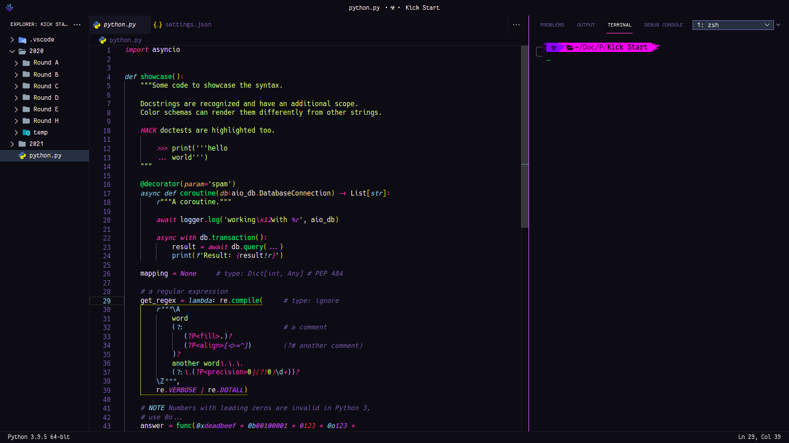

<pre>

██████╗ ██████╗  ██████╗ ██╗  ██╗██╗   ██╗▄█╗███████╗    ██████╗  ██████╗ ████████╗███████╗
██╔══██╗██╔══██╗██╔═████╗╚██╗██╔╝╚██╗ ██╔╝╚═╝██╔════╝    ██╔══██╗██╔═████╗╚══██╔══╝██╔════╝
██████╔╝██████╔╝██║██╔██║ ╚███╔╝  ╚████╔╝    ███████╗    ██║  ██║██║██╔██║   ██║   ███████╗
██╔═══╝ ██╔══██╗████╔╝██║ ██╔██╗   ╚██╔╝     ╚════██║    ██║  ██║████╔╝██║   ██║   ╚════██║
██║     ██║  ██║╚██████╔╝██╔╝ ██╗   ██║      ███████║    ██████╔╝╚██████╔╝   ██║   ███████║
╚═╝     ╚═╝  ╚═╝ ╚═════╝ ╚═╝  ╚═╝   ╚═╝      ╚══════╝    ╚═════╝  ╚═════╝    ╚═╝   ╚══════╝

</pre>

<h3 align="center">Terminal</h3>

<h3 align="center">VS Codium</h3>

<h3 align="center">Firefox</h3>

<h3 align="center">Gedit</h3>

<h3 align="center">Neovim</h3>

<h3 align="center">Arc Menu</h3>

## Folder structure

 . 
├─  .config 
│ ├─  ArcMenu 
│ │ ├─  ArcMenu 
│ │ ╰─  ArcTheme 
│ ├─  Code 
│ │ ╰─  User 
│ │   ├─  keybindings.json 
│ │   ├─  settings.json 
│ │   ├─  snippets 
│ │   │ ╰─  snippet.code-snippets 
│ │   ╰─  vsc.css 
│ ├─  Dash to Dock 
│ │ ╰─  dash-to-dock 
│ ├─  fish 
│ │ ├─  config.fish 
│ │ ├─  fish_variables 
│ │ ╰─  functions 
│ │   ├─  __bass.py 
│ │   ├─  bass.fish 
│ │   ╰─  nvm.fish 
│ ├─  nvim 
│ │ ╰─  init.vim 
│ ╰─  starship.toml 
├─  .icons 
│ ╰─  default 
│   ├─  index.theme 
│   ├─  vsc-back.svg 
│   ╰─  vsc.svg 
├─  .local 
│ ╰─  share 
│  ├─  arcmenu 
│  │ ╰─  stylesheet.css 
│  ╰─  fonts 
│    ├─  Algerian.ttf 
│    ├─  Anzelia.ttf 
│    ├─  CascadiaCodePL.ttf 
│    ├─  Caveat-VariableFont_wght.ttf 
│    ├─  Fira Code Regular Nerd Font Complete.ttf 
│    ├─  Hack Regular Nerd Font Ligature.ttf 
│    ├─  JetBrains Mono Regular Nerd Font.ttf 
│    ├─  lmroman10-regular.otf 
│    ├─  lmromandemi10-regular.otf 
│    ├─  MesloLGS NF Regular.ttf 
│    ├─  optima.ttf 
│    ╰─  Shorelines Script Bold.otf 
├─  .p10k.zsh 
├─  .zshrc 
├─  apps.txt 
├─  assets 
│ ├─  ArcMenu.png 
│ ├─  gedit.png 
│ ├─  neovim.png 
│ ├─  terminal.png 
│ ╰─  vscodium.png 
├─  package.txt 
├─  README.md 
╰─  usr 
  ╰─  share 
    ├─  gedit 
    │ ╰─  styles 
    │   ╰─  dracula.xml 
    ╰─  sushi 
      ╰─  gtksourceview-4 
        ╰─  styles 
          ╰─  builder-dark.style-scheme.xml 

1) ArcMenu configs can be imported from it's settings. Menu Layout is `Ubuntu Dash Style`. `Dotfiles/.local/share/arcmenu/stylesheet.css` is basically the layout CSS. Should be placed in `~/.local/share/arcmenu/stylesheet.css`.  
2) Vscode configs should be placed in `~/.config/[code|vscodium]/User`. Theme used in screenshot is [Sweet Dracula](https://marketplace.visualstudio.com/items?itemName=PROxZIMA.sweetdracula) (Made by me 😁)
    - `Dotfiles/.config/Code/User/vsc.css` is a special CSS file which I use to modify vscode UI (Vscode core file is edited so follow steps with care).
    - Copy both `Dotfiles/.icons/default/vsc-back.svg` and `Dotfiles/.icons/default/vsc.svg` to `/usr/share/vscodium-bin/resources/app/out/vs/workbench`. Resource base directory can be `/usr/lib/code` or any other. `resources/app/...` is same for all.
    - First take backup of the main css file
        - `sudo cp /usr/share/vscodium-bin/resources/app/out/vs/workbench/workbench.desktop.main.css /usr/share/vscodium-bin/resources/app/out/vs/workbench/workbench.desktop.main.css2`
    - Append vsc.css to `workbench.desktop.main.css`
        - `echo 'cat Dotfiles/.config/Code/User/vsc.css >> /usr/share/vscodium-bin/resources/app/out/vs/workbench/workbench.desktop.main.css' | sudo -s`
    - Restart Vscode. Now Vscode will show a popup `Your code installation appears to be corrupt` as you modified a core file. To fix this install [Fix VSCode Checksums](https://marketplace.visualstudio.com/items?itemName=lehni.vscode-fix-checksums) and from command palette execute `Fix Checksums: Apply` and restart again.
    - Boom!!!
    - If you don't want to touch the core file (which is not a big deal) you can use [Customize UI](https://marketplace.visualstudio.com/items?itemName=iocave.customize-ui). All required settings are present in `settings.json`. This method may/may not work as extensions can't be guaranteed to work always.  
3) Firefox theme is mine too. Every little detail can be found [here](https://github.com/PROxZIMA/Firefox-Theme/)  
4) `zsh` is literally an awesome shell. Following are the two themes I use
    - `Dotfiles/.p10k.zsh` which I made using [Powerlevel10k](https://github.com/romkatv/powerlevel10k) :) I use it in vscode. See the screenshots. Installation can be found at P10K docs.
    - Other is [Spaceship](https://github.com/spaceship-prompt/spaceship-prompt) prompt. This is my default terminal prompt. Config: `Dotfiles/.config/starship.toml`.
    - `Dotfiles/.zshrc` should be placed in `~/`. Some aliases in-there are linked to the scripts I use. Can be found [here](https://github.com/PROxZIMA/My-Scripts).  
5) I don't use `fish` as my default shell but yeah I used to. So it's config is included too.  
6) I use `Dash to Dock` extensions so I've included it's config too. Import it from the extension settings.  
7) `Neovim` is love. I use [junegunn/vim-plug](https://github.com/junegunn/vim-plug) as my Vim plugin manager. Along with extensions mentioned in `Dotfiles/.config/nvim/init.vim`.  
8) `Dotfiles/.local/share/fonts` include some famous open-source ttf/otf.  
9) `Dotfiles/usr/share/gedit/styles/dracula.xml` is dracula based theme for Gedit.  
10) `Dotfiles/usr/share/sushi/gtksourceview-4/styles/builder-dark.style-scheme.xml` is `[sushi](https://gitlab.gnome.org/GNOME/sushi)` (A GNOME file previewer) style scheme derived from `dracula.xml`.  
11) `Dotfiles/apps.txt` and `Dotfiles/package.txt` are simply applications and packages I use.  

Sooo that's it for now. I'll update this repo time to time. Feel free to raise an issue if something is wrong. See ya!!!  
___
<h2 align="center">ARIGATOU</h2>
