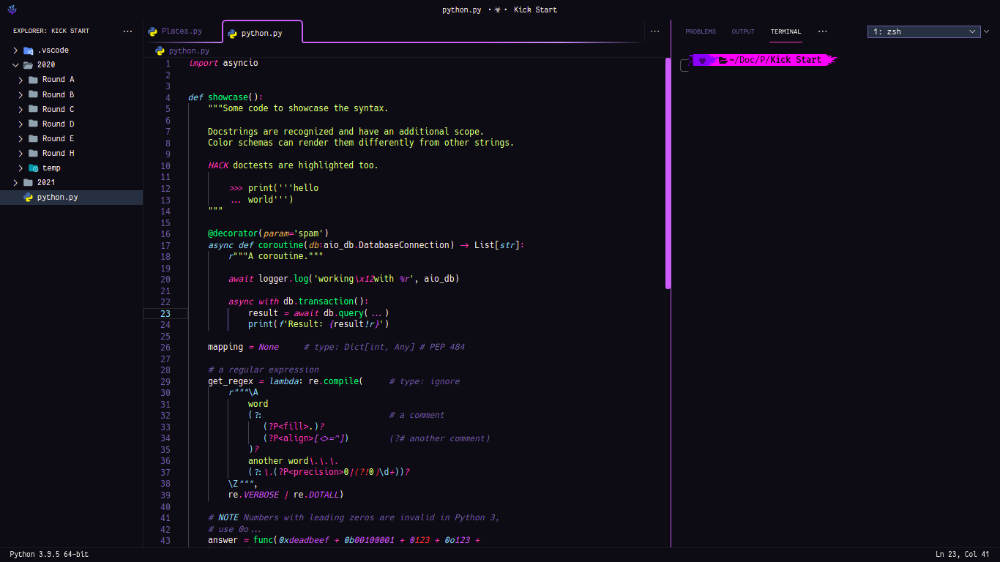
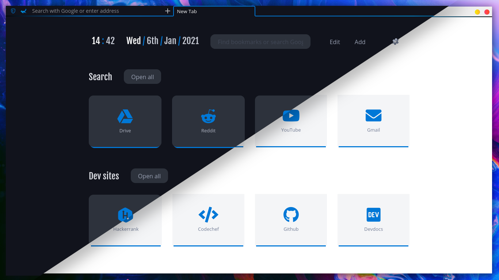

  <pre>       </pre>

<h3 align="center">Terminal</h3>

<h3 align="center">VS Codium</h3>

<h3 align="center">Firefox</h3>

<h3 align="center">Gedit</h3>

<h3 align="center">Neovim</h3>

<h3 align="center">Resource Monitor</h3>

<h3 align="center">Arc Menu</h3>

## Folder structure

 . 
├─  .config 
│ ├─  alacritty 
│ │ ╰─  alacritty.yml 
│ ├─  ArcMenu 
│ │ ├─  ArcMenu 
│ │ ╰─  ArcTheme 
│ │─  ascii.txt 
│ ├─  Code 
│ │ ╰─  User 
│ │   ├─  keybindings.json 
│ │   ├─  settings.json 
│ │   ├─  snippets 
│ │   │ ╰─  snippet.code-snippets 
│ │   ╰─  vsc.css 
│ ├─  Dash-to-Panel 
│ │ ╰─  dash-to-panel 
│ ├─  fish 
│ │ ├─  config.fish 
│ │ ├─  fish_variables 
│ │ ╰─  functions 
│ │   ├─  __bass.py 
│ │   ├─  bass.fish 
│ │   ╰─  nvm.fish 
│ ├─  htop 
│ │ ╰─  htoprc 
│ ├─  neofetch 
│ │ ╰─  config.conf 
│ ├─  nvim 
│ │ ╰─  init.vim 
│ ╰─  starship.toml 
├─  .fonts.conf 
├─  .icons 
│ ╰─  default 
│   ├─  index.theme 
│   ╰─  vsc 
│     ├─  peek.png 
│     ├─  peek2.png 
│     ├─  peek3.png 
│     ├─  peek4.png 
│     ├─  vsc-back.svg 
│     ╰─  vsc.svg 
├─  .local 
│ ╰─  share 
│   ├─  arcmenu 
│   │ ╰─  stylesheet.css 
│   ╰─  fonts 
│     ├─  Algerian.ttf 
│     ├─  Anzelia.ttf 
│     ├─  Cascadia Code PL.ttf 
│     ├─  Caveat.ttf 
│     ├─  FantasqueSansMono Nerd Font Mono.ttf 
│     ├─  FantasqueSansMono Nerd Font.ttf 
│     ├─  FiraCode Nerd Font.ttf 
│     ├─  Hack Nerd Font Mono.ttf 
│     ├─  JetBrainsMono Nerd Font.ttf 
│     ├─  LM Roman 10.otf 
│     ├─  LM Roman Demi 10.otf 
│     ├─  MesloLGS NF.ttf 
│     ├─  Operator Mono SSm Lig Book Italic.otf 
│     ├─  Operator Mono SSm Lig Book.otf 
│     ├─  Optima.ttf 
│     ╰─  Shorelines Script Bold.otf 
├─  .p10k.zsh 
├─  .zshrc 
├─  apps.txt 
├─  assets 
│ ├─  arcMenu.png 
│ ├─  bpytop.png 
│ ├─  firefox.png 
│ ├─  gedit.png 
│ ├─  neovim.png 
│ ├─  terminal.png 
│ ╰─  vscode.png 
├─  package.txt 
├─  README.md 
╰─  usr 
  ╰─  share 
    ├─  gedit 
    │ ╰─  styles 
    │   ╰─  dracula.xml 
    ╰─  sushi 
      ╰─  gtksourceview-4 
        ╰─  styles 
          ╰─  builder-dark.style-scheme.xml 

## ArcMenu

- Configs can be imported from it's settings. Menu Layout is `Modern Menu Layout > Unity`.
- `.dotfiles/.local/share/arcmenu/stylesheet.css` is the layout CSS. Should be placed in `~/.local/share/arcmenu/stylesheet.css`.

## Vscode

Configs should be placed in `~/.config/[code|vscodium]/User`. Theme used in screenshot is [Sweet Dracula](https://marketplace.visualstudio.com/items?itemName=PROxZIMA.sweetdracula) (Made by me 😁)
- `.dotfiles/.config/Code/User/vsc.css` is a special CSS file which I use to modify vscode UI (Vscode core file is edited so follow steps with care).
- Copy `.dotfiles/.icons/default/vsc/*` to `/usr/share/[code|codium|vscodium-bin]/resources/app/out/vs/workbench`.
- First take backup of the main css file
  - `sudo cp /usr/share/codium/resources/app/out/vs/workbench/workbench.desktop.main.css /usr/share/codium/resources/app/out/vs/workbench/workbench.desktop.main.css2`
- Append vsc.css to `workbench.desktop.main.css`
  - `echo 'cat .dotfiles/.config/Code/User/vsc.css >> /usr/share/codium/resources/app/out/vs/workbench/workbench.desktop.main.css' | sudo -s`
- Restart Vscode. Now Vscode will show a popup `Your code installation appears to be corrupt` as you modified a core file. To fix this install [Fix VSCode Checksums](https://marketplace.visualstudio.com/items?itemName=lehni.vscode-fix-checksums) and from command palette execute `Fix Checksums: Apply` and restart again.
- Boom!!!
- If you don't want to touch the core file (which is not a big deal) you can use [Customize UI](https://marketplace.visualstudio.com/items?itemName=iocave.customize-ui). All required settings are present in `settings.json`. This method may/may not work as extensions can't be guaranteed to work always.

## Firefox

Firefox theme is mine too. Every little detail can be found at [PROxZIMA/Firefox-Theme](https://github.com/PROxZIMA/Firefox-Theme/)

## ZSH

`zsh` is an awesome shell with tons of customizations. Following are the two themes I use
- `.dotfiles/.p10k.zsh` which I made using [Powerlevel10k](https://github.com/romkatv/powerlevel10k) :) I use it in vscode. See the screenshots. Installation can be found at P10K docs.
- Other is [Spaceship](https://github.com/spaceship-prompt/spaceship-prompt) prompt. This is my default terminal prompt. Config: `.dotfiles/.config/starship.toml`.
- `.dotfiles/.zshrc` should be placed in `~/`. Some aliases in-there are linked to the scripts I use. Can be found [here](https://github.com/PROxZIMA/My-Scripts).

## Fish

I don't use `fish` as my default shell but yeah, I used to. So it's config is included too.

## Dash to Dock

Gnome shell extension `Dash to Dock` turns default shell panel to a highly customizable dock. Import it's config from the extension settings.

## Neofetch

- System info in 1st screenshot is displayed using `neofetch`. I use `FiraCode Nerd Font` so I've added some glyphs before each info line in the config.
- `.dotfiles/.config/neofetch/config.conf` goes in `~/.config/neofetch/config.conf`.

## Neovim

`Neovim` is ❤️. I use [wbthomason/packer](https://github.com/wbthomason/packer.nvim) as my packaging tool. Detailed installation in it's [README](.config/nvim/README.md).

## Fonts

`.dotfiles/.local/share/fonts` include some famous open-source ttf/otf.

## Gedit

`.dotfiles/usr/share/gedit/styles/dracula.xml` is dracula based theme for Gedit.  

## Sushi

`.dotfiles/usr/share/sushi/gtksourceview-4/styles/builder-dark.style-scheme.xml` is [`sushi`](https://gitlab.gnome.org/GNOME/sushi) (A GNOME file previewer) style scheme derived from `dracula.xml`.

---
- I switched to [`bpytop`](https://github.com/aristocratos/bpytop). It's much better than other tops :)

- `.dotfiles/apps.txt` and `.dotfiles/package.txt` are the applications and packages I use.

Sooo that's it for now. I'll update this repo time to time. Feel free to raise an issue if something is wrong. See ya!!!  
___
<h2 align="center">ARIGATOU ❤️</h2>
