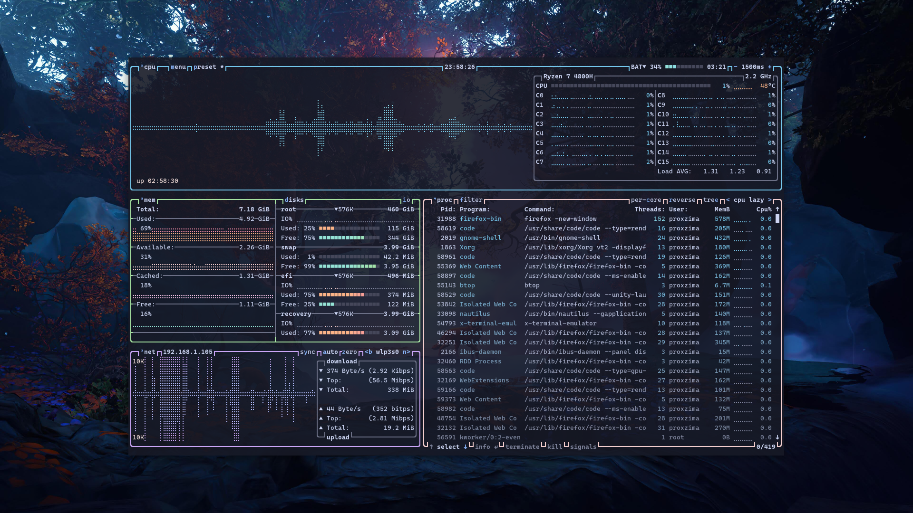

<div align="center">
  <a href='#'></a>
</div>

<!-- <h3 align="center">Terminal</h3>
<p align="center"></p>

<h3 align="center">VS Codium</h3>
<p align="center"></p>

<h3 align="center">Firefox</h3>
<p align="center"></p>

<h3 align="center">Neovim</h3>
<p align="center"></p>

<h3 align="center">Resource Monitor</h3>
<p align="center"></p> -->


<table>
<tr>
<td>

```
⠀⠀ ❄️ -> Setup
 -----------------------------------

 ╭─ Distro  -> Pop!_OS 22.04 x86_64
 ├─ Editor  -> VSCode / NeoVim
 ├─ Browser -> Firefox
 ├─ Shell   -> ZSH
 ╰─ Resource Monitor -> Btop

 ╭─ Model -> ASUS TUF Gaming A15
 ├─ CPU   -> Ryzen 7 4800H @ 4.3GHz
 ├─ GPU   -> NVIDIA GeForce RTX 3050
 ╰─ Resolution -> 1920x1080

 ╭─ DE       -> GNOME 42.3.1
 ├─ WM       -> Mutter
 ├─ Terminal -> Kitty
 ├─ Theme    -> Sweet-Dark
 ├─ Icons    -> Sweet-Rainbow
 ╰─ Font     -> Fira Sans Semi-Light

                        
```

</td>
<td rowspan='3'>


</td>
</tr>
<tr></tr>
<tr>
<td>

### Wallpapers
[](https://photos.app.goo.gl/h7EE46K7qDgLpQUv9)

</td>
</tr>
</table>

### Vscode
Configs should be placed in `~/.config/[code|vscodium]/User`. Theme used in screenshot is [`Sweet Dracula`](https://marketplace.visualstudio.com/items?itemName=PROxZIMA.sweetdracula) (Made by me 😁)
- Install [`Fix VSCode Checksums`](https://marketplace.visualstudio.com/items?itemName=lehni.vscode-fix-checksums) extension.
- [`.dotfiles/.config/Code/User/vsc.css`](.config/Code/User/vsc.css) is a special CSS file which I use to modify vscode's UI (Vscode core file is edited so follow steps with care).
    ```sh
    $ # Replace [code|codium|vscodium-bin] with appropriate folder name.
    $ resPrefix=/usr/share/[code|codium|vscodium-bin]/resources/app/out/vs/code/electron-[browser|sandbox]/workbench
    $ # Symlink required files in the above folder.
    $ ln -s '/full/path/to/.dotfiles/.config/Code/User/vsc.css' $resPrefix
    $ ln -s '/full/path/to/.dotfiles/.icons/default/vsc/' $resPrefix
    ```
- Open `$resPrefix/workbench.html` and add `<link rel="stylesheet" href='vsc.css'>` inside the `<head>` tag.
    ```sh
    $ sed -i 's;</head>;<link rel="stylesheet" href="vsc.css"></head>;g' $resPrefix/workbench.html
    ```
- Restart Vscode. Open command palette and execute `Fix Checksums: Apply`. Restart again.
  - Perform above 2 steps every time vscode is updated.
- ***Boom!!!***
- If you don't want to touch the core file (which is not a big deal) you can use [`Customize UI`](https://marketplace.visualstudio.com/items?itemName=iocave.customize-ui).
  - This method may/may not work as extensions can't be guaranteed to always work.
  - All required settings are present in `settings.json`.
  - Use following command to convert your `CSS` file to `Customize UI`'s json object.
    ```sh
    $ sed -ze 's/\n/ /g' -Ee 's,/\*[^*]*\*+([^/*][^*]*\*+)*/,,g' -Ee 's/ {2,}//g' -Ee 's/\}([^\{]*) \{/", "\1": "/g' -e 's/:root \{/{":root": "/g' vsc.css
    ```

### Firefox
Firefox theme is mine too. Installation can be found at [`PROxZIMA/Firefox-Theme`](https://github.com/PROxZIMA/Firefox-Theme/).

### Terminal
- After hopping over a number terminals I finally settled with [`Kitty 😻`](https://github.com/kovidgoyal/kitty).
- Configs :: [`.dotfiles/.config/kitty`](.config/kitty/).

### ZSH
[`zsh`](https://www.zsh.org/) is an awesome shell with tons of customizations when used with [`ohmyzsh`](https://github.com/ohmyzsh/ohmyzsh). Following are the two themes I use:
- [`.dotfiles/.p10k.zsh`](.p10k.zsh) which I made using [`Powerlevel10k`](https://github.com/romkatv/powerlevel10k) :) I use it in [vscode](./assets/vscode.png). Installation can be found at P10K docs but placing it in `~/` will do it.
- Other is my default terminal prompt :: [`Spaceship`](https://github.com/spaceship-prompt/spaceship-prompt). This is . Configs :: [`.dotfiles/.config/starship.toml`](.config/starship.toml).
- [`.dotfiles/.zshrc`](.zshrc) should be placed in `~/`. Some aliases in-there [`(.dotfiles/.aliases)`](.aliases) are linked to the scripts I use which can be found [`here`](https://github.com/PROxZIMA/My-Scripts).

### Neofetch
- System info in the terminal is displayed using `neofetch`. I've added some glyphs before each info line in the config. Small change but looks good :p
- Nerd fonts are highly recommended.
- Configs :: [`.dotfiles/.config/neofetch/config.conf`](.config/neofetch/config.conf).

### Neovim
- `Neovim` is ❤️.
- All credits goes to [`NvChad`](https://github.com/NvChad/NvChad).
- GUI : [`Neovide`](https://github.com/neovide/neovide).
- Configs :: [`.dotfiles/.config/nvim`](.config/nvim/).

### Gedit
[`.dotfiles/usr/share/gtksourceview-4/styles/dracula.xml`](usr/share/gtksourceview-4/styles/dracula.xml) is a dracula based theme I made for [Gedit](./assets/gedit.png).

### ArcMenu
- Configs can be imported from it's settings. Menu Layout is `Modern Menu Layout > Unity`.
- Configs :: [`.dotfiles/.local/share/arcmenu/stylesheet.css`](.local/share/arcmenu/stylesheet.css) is the layout CSS.

### Dash to Panel
- Gnome shell extension `Dash to Panel` turns default shell panel to a highly customizable dock. Import it's config from the extension settings.
- Configs :: [`./dotfiles/.config/Dash-to-Panel/dash-to-panel`](.config/Dash-to-Panel/dash-to-panel)

### Sushi
[`.dotfiles/usr/share/sushi/gtksourceview-4/styles/builder-dark.style-scheme.xml`](usr/share/sushi/gtksourceview-4/styles/builder-dark.style-scheme.xml) is [`sushi`](https://gitlab.gnome.org/GNOME/sushi) (A GNOME file previewer) style scheme derived from `dracula.xml`.

### Fonts
[`.dotfiles/.local/share/fonts`](.local/share/fonts/) include some nerd ttf/otf fonts.

### Fish
- I don't use `fish` as my default shell but yeah, I used to.
- Configs :: [`.dotfiles/.config/fish`](.config/fish) and [`.dotfiles/.local/share/fish`](.local/share/fish/).

### Gnome Shell Extensions
- [Alt+Tab Scroll Workaround](https://extensions.gnome.org/extension/5282/alttab-scroll-workaround/)
- [ArcMenu](https://extensions.gnome.org/extension/3628/arcmenu/)
- [Clipboard Indicator](https://extensions.gnome.org/extension/779/clipboard-indicator/)
- [Customize IBus](https://extensions.gnome.org/extension/4112/customize-ibus/)
- [Dash to Panel](https://extensions.gnome.org/extension/1160/dash-to-panel/)
- [GSConnect](https://extensions.gnome.org/extension/1319/gsconnect/)
- [Net speed Simplified](https://extensions.gnome.org/extension/3724/net-speed-simplified/)
- [Tiling Assistant](https://extensions.gnome.org/extension/3733/tiling-assistant/)
- [User Themes](https://extensions.gnome.org/extension/19/user-themes/)
---
> *Note*
> - I switched to [`btop`](https://github.com/aristocratos/btop). It's much better than other tops :)
> - `.dotfiles/apps.txt` and `.dotfiles/package.txt` are the applications and packages I use.

Sooo that's it for now. I'll update this repo time to time. Feel free to raise an issue if something is wrong. See ya!!!

___
<h2 align="center">ARIGATOU ❤️</h2>
