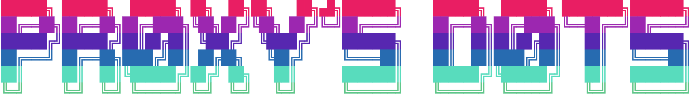
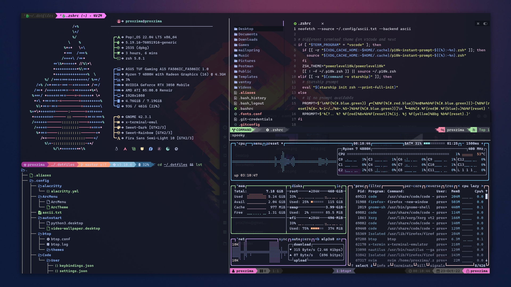
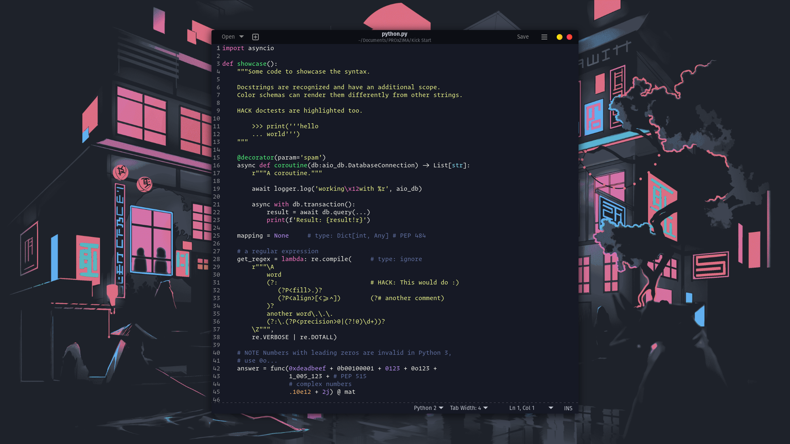
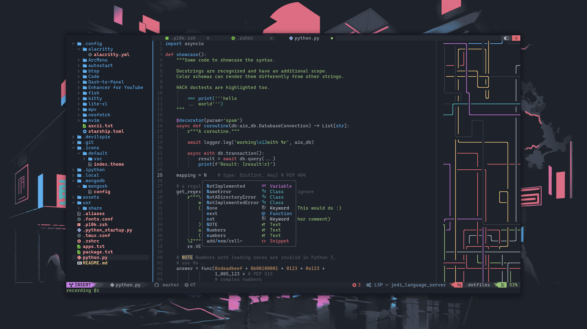
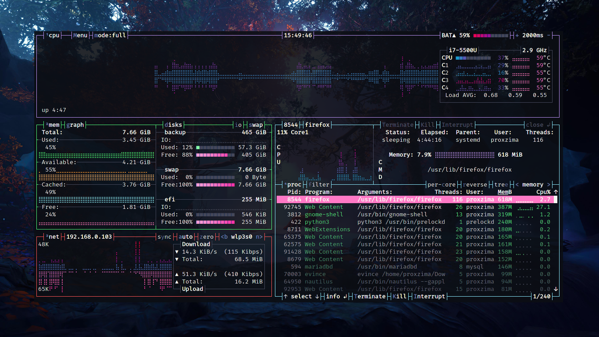
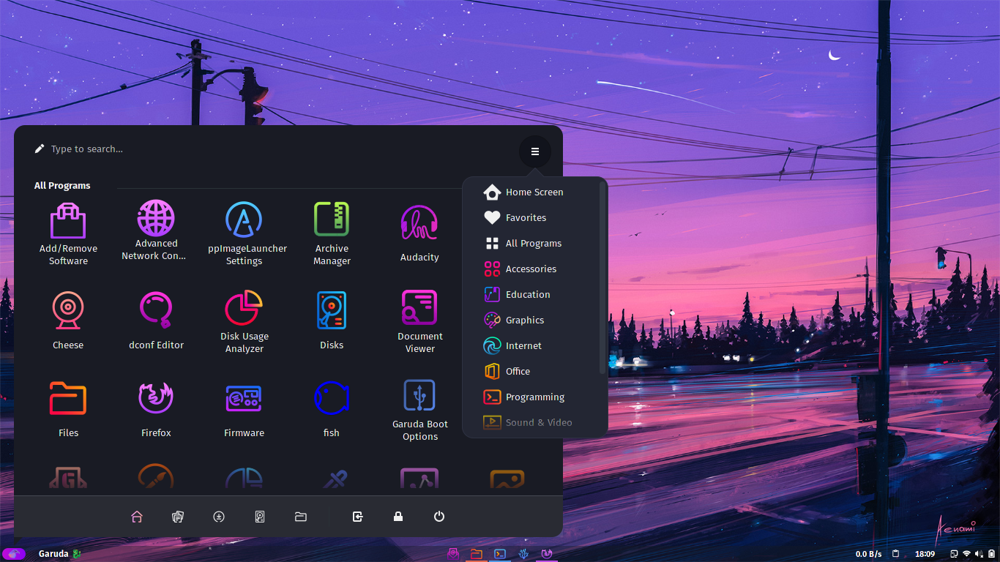

<div align="center">
  <pre><br><br><br><a href='#'></a><br><br><br><br></pre>
</div>

<h3 align="center">Terminal</h3>
<p align="center"></p>

<h3 align="center">VS Codium</h3>
<p align="center"></p>

<h3 align="center">Firefox</h3>
<p align="center"></p>

<h3 align="center">Gedit</h3>
<p align="center"></p>

<!--
<h3 align="center">Neovim</h3>
<p align="center"></p>
-->

<h3 align="center">Resource Monitor</h3>
<p align="center"></p>

<h3 align="center">Arc Menu</h3>
<p align="center"></p>

## Folder structure

```css
 .
├──  .config
│  ├──  alacritty
│  │  └──  alacritty.yml
│  ├──  ArcMenu
│  │  ├──  ArcMenu
│  │  └──  ArcTheme
│  ├──  ascii.txt
│  ├──  Code
│  │  └──  User
│  │     ├──  keybindings.json
│  │     ├──  settings.json
│  │     ├──  snippets
│  │     │  └──  snippet.code-snippets
│  │     └──  vsc.css
│  ├──  Dash-to-Panel
│  │  └──  dash-to-panel
│  ├──  fish
│  │  ├──  config.fish
│  │  ├──  fish_variables
│  │  └──  functions
│  │     ├──  __bass.py
│  │     ├──  bass.fish
│  │     └──  nvm.fish
│  ├──  htop
│  │  └──  htoprc
│  ├──  kitty
│  │  ├──  kitty.conf
│  │  ├──  scroll_mark.py
│  │  └──  search.py
│  ├──  neofetch
│  │  └──  config.conf
│  ├──  nvim
│  │  └──  init.vim
│  └──  starship.toml
├──  .fonts.conf
├──  .icons
│  └──  default
│     ├──  index.theme
│     └──  vsc
│        ├──  peek.png
│        ├──  peek2.png
│        ├──  peek3.png
│        ├──  peek4.png
│        ├──  vsc-back.svg
│        └──  vsc.svg
├──  .local
│  └──  share
│     ├──  arcmenu
│     │  └──  stylesheet.css
│     └──  fonts
│        ├──  3270-Medium Nerd Font Complete Mono.otf
│        ├──  Algerian.ttf
│        ├──  Anzelia.ttf
│        ├──  Cascadia Code PL.ttf
│        ├──  Caveat.ttf
│        ├──  delugia-complete
│        │  ├──  .uuid
│        │  ├──  DelugiaComplete-Bold.ttf
│        │  ├──  DelugiaComplete-BoldItalic.ttf
│        │  ├──  DelugiaComplete-Italic.ttf
│        │  ├──  DelugiaComplete.ttf
│        │  ├──  DelugiaCompleteLight-Italic.ttf
│        │  └──  DelugiaCompleteLight.ttf
│        ├──  delugia-mono-complete
│        │  ├──  .uuid
│        │  ├──  DelugiaMonoComplete-Bold.ttf
│        │  ├──  DelugiaMonoComplete-BoldItalic.ttf
│        │  ├──  DelugiaMonoComplete-Italic.ttf
│        │  ├──  DelugiaMonoComplete.ttf
│        │  ├──  DelugiaMonoCompleteLight-Italic.ttf
│        │  └──  DelugiaMonoCompleteLight.ttf
│        ├──  FantasqueSansMono Nerd Font Mono.ttf
│        ├──  FantasqueSansMono Nerd Font.ttf
│        ├──  FiraCode Nerd Font.ttf
│        ├──  Hack Nerd Font Mono.ttf
│        ├──  JetBrainsMono Nerd Font.ttf
│        ├──  LM Roman 10.otf
│        ├──  LM Roman Demi 10.otf
│        ├──  MesloLGS NF.ttf
│        ├──  Operator Mono SSm Lig Book Italic.otf
│        ├──  Operator Mono SSm Lig Book.otf
│        ├──  Optima.ttf
│        └──  Shorelines Script Bold.otf
├──  .p10k.zsh
├──  .tmux.conf
├──  .zsh_alias
├──  .zshrc
├──  apps.txt
├──  assets
│  ├──  arcmenu.png
│  ├──  bpytop.png
│  ├──  dots.svg
│  ├──  firefox.png
│  ├──  gedit.png
│  ├──  neovim.png
│  ├──  terminal.png
│  └──  vscode.png
├──  package.txt
├──  README.md
└──  usr
   └──  share
      ├──  gedit
      │  └──  styles
      │     └──  dracula.xml
      └──  sushi
         └──  gtksourceview-4
            └──  styles
               └──  builder-dark.style-scheme.xml
```


## Vscode

Configs should be placed in `~/.config/[code|vscodium]/User`. Theme used in screenshot is [`Sweet Dracula`](https://marketplace.visualstudio.com/items?itemName=PROxZIMA.sweetdracula) (Made by me 😁)
- `.dotfiles/.config/Code/User/vsc.css` is a special CSS file which I use to modify vscode UI (Vscode core file is edited so follow steps with care).
- Copy `.dotfiles/.icons/default/vsc/*` to `/usr/share/[`code|codium|vscodium-bin`]/resources/app/out/vs/workbench`.
- First take backup of the main css file
  - `sudo cp /usr/share/codium/resources/app/out/vs/workbench/workbench.desktop.main.css /usr/share/codium/resources/app/out/vs/workbench/workbench.desktop.main.css2`
- Append vsc.css to `workbench.desktop.main.css`
  - `echo 'cat .dotfiles/.config/Code/User/vsc.css >> /usr/share/codium/resources/app/out/vs/workbench/workbench.desktop.main.css' | sudo -s`
- Restart Vscode. Now Vscode will show a popup `Your code installation appears to be corrupt` as you modified a core file. To fix this install [`Fix VSCode Checksums`](https://marketplace.visualstudio.com/items?itemName=lehni.vscode-fix-checksums) and from command palette execute `Fix Checksums: Apply` and restart again.
- Boom!!!
- If you don't want to touch the core file (which is not a big deal) you can use [`Customize UI`](https://marketplace.visualstudio.com/items?itemName=iocave.customize-ui). All required settings are present in `settings.json`. This method may/may not work as extensions can't be guaranteed to work always.


## Firefox

Firefox theme is mine too. Every little detail can be found at [`PROxZIMA/Firefox-Theme`](https://github.com/PROxZIMA/Firefox-Theme/).


## Terminal

After hopping over number terminals I'm finally settled with [`Kitty 😻`](https://github.com/kovidgoyal/kitty). Config: `.dotfiles/.config/kitty`.


## ZSH

[`zsh`](https://www.zsh.org/) is an awesome shell with tons of customizations when used with [`ohmyzsh`](https://github.com/ohmyzsh/ohmyzsh). Following are the two themes I use
- `.dotfiles/.p10k.zsh` which I made using [`Powerlevel10k`](https://github.com/romkatv/powerlevel10k) :) I use it in vscode. See the screenshots. Installation can be found at P10K docs but placing it in `~/` will do it.
- Other is [`Spaceship`](https://github.com/spaceship-prompt/spaceship-prompt) prompt. This is my default terminal prompt. Config: `.dotfiles/.config/starship.toml`.
- `.dotfiles/.zshrc` should be placed in `~/`. Some aliases in-there `(.dotfiles/.aliases)` are linked to the scripts I use which can be found [`here`](https://github.com/PROxZIMA/My-Scripts).


## Fish

I don't use `fish` as my default shell but yeah, I used to. So it's config is included too.


## Neofetch

- System info in 1st screenshot is displayed using `neofetch`. I've added some glyphs before each info line in the config. Small change but looks good :p
- `.dotfiles/.config/neofetch/config.conf` goes in `~/.config/neofetch/config.conf`.


## Neovim

- `Neovim` is ❤️. I use [`wbthomason/packer`](https://github.com/wbthomason/packer.nvim) as my packaging tool. Detailed installation in it's [`README`](.config/nvim/README.md).
- Big update gonna come for my Neovim :)


## Gedit

`.dotfiles/usr/share/gedit/styles/dracula.xml` is a dracula based theme I made for Gedit.


## ArcMenu

- Configs can be imported from it's settings. Menu Layout is `Modern Menu Layout > Unity`.
- `.dotfiles/.local/share/arcmenu/stylesheet.css` is the layout CSS. Should be placed in `~/.local/share/arcmenu/stylesheet.css`.


## Dash to Dock

Gnome shell extension `Dash to Dock` turns default shell panel to a highly customizable dock. Import it's config from the extension settings.


## Sushi

`.dotfiles/usr/share/sushi/gtksourceview-4/styles/builder-dark.style-scheme.xml` is [`sushi`](https://gitlab.gnome.org/GNOME/sushi) (A GNOME file previewer) style scheme derived from `dracula.xml`.


## Fonts

`.dotfiles/.local/share/fonts` include some famous open-source ttf/otf.

---
- I switched to [`bpytop`](https://github.com/aristocratos/bpytop). It's much better than other tops :)

- `.dotfiles/apps.txt` and `.dotfiles/package.txt` are the applications and packages I use.

Sooo that's it for now. I'll update this repo time to time. Feel free to raise an issue if something is wrong. See ya!!!<br><br>
___
<h2 align="center">ARIGATOU ❤️</h2>
